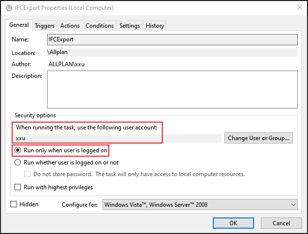

# Batch IFC & DWG Export

This plugin includes two PythonPart scripts that assist you in performing the following tasks with ALLPLAN:

* Export multiple IFC files
* Export multiple DWG/DXF files from the building structure

You have two options to tigger the batch export:

1.  Start the PythonPart script from ALLPLAN library and trigger the batch export manually
1.  Schedule a task in Task Scheduler to trigger the batch export automatically


> [!CAUTION]
> As ALLPLAN currently doesn't allow the IFC exporter to export content from a drawing file which is currently active on anohter PC, the batch export also has this limitation. We suggest to make sure no one is accessing the drawing file, which will be used in your batch export.

# Installation
You can install this plugin "Batch IFC&DWG Export" from the plugin manager directly in ALLPLAN. 

Alternatively, you can also download the ALLEP package from the [release page](https://github.com/xinling-xu/batch-ifc-dwg-export/releases). And drag and drop the package into ALLPLAN to install it.

You need at least ALLPLAN 2026 to install the package.

## Installed PythonPart Scripts
After installation, you can find two following PythonPart scripts:
* DWGExportByFileList.PYP
* IFCExportByFileList.PYP

in the ALLPLAN Library:
`Office` → `ALLPLAN GmbH` → `Batch IFC&DWG Export` → `Contents`

## Installed Setting Templates
Togehter with PythonPart scripts, the installation package also includes setting templates to help you to prepare the batch export. They can be found under:

`Std\Library\ALLPLAN GmbH\Batch IFC&DWG Export\Setting Template\`

# How to Use
For both PythonPart scripts, you need to prepare one CSV file and some subfolders containing ALLPLAN favorites inside one folder, before starting the batch export. Please check the information below to prepare settings.

## Batch IFC Export
Prepare following folder structure for setting files in one folder:
```
IFCExport.CSV
<dfSettings>
  ├── drawing-file-favorite-1.xml
  └── ...
<ifcSettings>
  ├── ifc-export-favorite-1.nth
  └── ...
<layerSettings>
  ├── layer-favorite-1.lfa
  └── ...
```


The CSV file contains all export settings. Each row in this file will export one IFC file. The filename of the CSV file must contain the string **IFCExport**. Explaination of the file structure of the CSV file see below:

| Column Name       | Example Value               | Note                                                                                                                                        |
| ----------------- | --------------------------- | ------------------------------------------------------------------------------------------------------------------------------------------- |
| hostName          | localhost                   | The hostname of the server which stores the project.                                                                                        |
| projectName       | Hello Allplan! 2024         | The name of the project on the disk.                                                                                                        |
| dfSelection       | drawing-file-favorite-1.xml | ⚠️ The filename of the drawing file favorite inside the sub folder `dfSelections`. Only those from IFC export function are supported.        |
| layerSetting      | layer-favorite-1.lfa        | The filename of the layer setting favorite inside the sub folder `layerSettings`.                                                           |
| ifc_Version       | ifc_4                       | ⚠️ **DEPRECATED!** The IFC file version is now included in the IFC export setting favorite file. The setting in this column will be ignored. |
| ifcSetting        | ifc-export-favorite-1.nth   | The filename of the IFC export setting favorite inside the sub folder `ifcSettings`.                                                        |
| destinationFolder | C:\\IFC Export\\            | Define the folder to save the exported file.                                                                                                |
| ifcFilename       | filename.ifc                | Define the filename of the IFC file.                                                                                                        |

## Batch DWG Export
Prepare following folder structure for setting files in one folder:
```
DWGExport.CSV
<cfgSettings>
  ├── configuration-file-1.cfg
  └── ...
<dfSettings>
  ├── drawing-file-favorite-1.xml
  └── ...
<dwgSettings>
  ├── dwg-export-favorite-1.nth
  └── ...
<layerSettings>
  ├── layer-favorite-1.lfa
  └── ...
```
The CSV file contains all export settings. Each row in this file will export one DWG or DXF file. The filename of the CSV file must contain the string **DWGExport**. Explaination of the file structure of the CSV file see below:

| Column Name       | Example Value               | Note                                                                                                                                                                   |
| ----------------- | --------------------------- | ---------------------------------------------------------------------------------------------------------------------------------------------------------------------- |
| hostName          | localhost                   | The hostname of the server which stores the project.                                                                                                                   |
| projectName       | Hello Allplan! 2024         | The name of the project on the disk.                                                                                                                                   |
| dfSelection       | drawing-file-favorite-1.xml | The filename of the drawing file favorite inside the sub folder `dfSelections`. Both favorites from the building structure and from IFC export function are supported. |
| layerSetting      | layer-favorite-1.lfa        | The filename of the layer setting favorite inside the sub folder `layerSettings`.                                                                                      |
| version           | 2018                        | The version of the DWG or DXF file. Please check ALLPLAN DWG export function to see which version is supported.                                                        |
| dwgSetting        | dwg-export-favorite-1.nth   | The filename of the DWG export favorite inside the sub folder `dwgSettings`.                                                                                   |
| cfgSetting        | configuration-file-1.cfg   | The filename of the DWG export configuration file inside the sub folder `cfgSettings`. This will replace the configuration setting used inside the DWG export favorite file during the installation.                                                                                   |
| destinationFolder | C:\\DWG Export\\            | Define the folder to save the exported file.                                                                                                                           |
| filename          | filename.dwg                | Define both the filename and the file type of exported file. Both DWG and DXF are supported.                                                                           |
## Start Batch Export Manually
1. Start the PythonPart script from library
2. Select the CSV file
3. Click export and wait


## Schedule Batch Export with Task Scheduler
Before you set up the scheduled task, please check if it works under the command line. You can use following command line to start ALLPLAN and a PythonPart script automatically. If everything goes smoothly, ALLPLAN will close itself afterwards. Please check the [online documentation](https://pythonparts.allplan.com/latest/manual/features/run_from_command_line/) for details.
```
"C:\Program Files\Allplan\Allplan 2026\Prg\Allplan_2026.exe" -o "@C:\IFCExportByFileList.pyp" "C:\Settings\IFCExport.csv"
```
Please check the screenshot below to set up the task correctly.


Make sure you start ALLPLAN in foreground by choosing the correct user and running the task only when the user is logged on. The scheduled export won't work, if ALLPLAN starts in background.



# Any Issues?
If you have identified any issues, please [open an issue](https://github.com/xinling-xu/batch-ifc-dwg-export/issues).